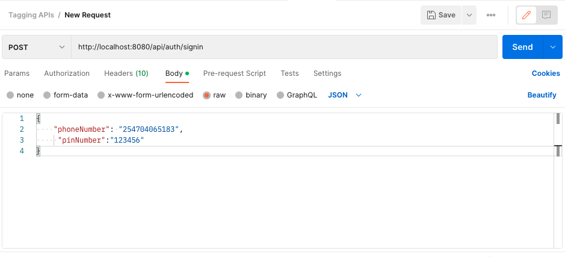
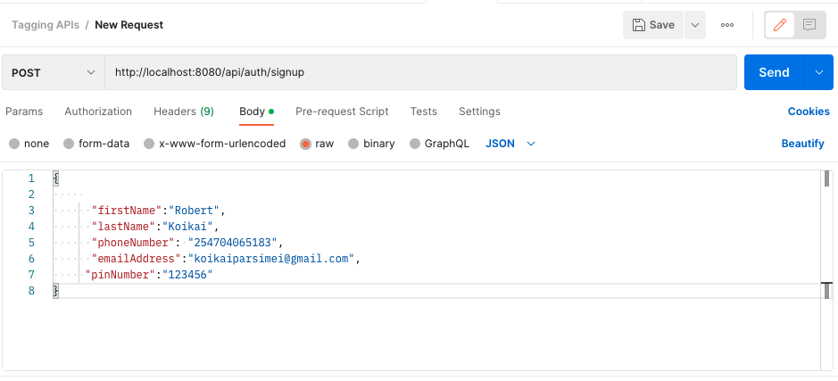

## Project setup
```
Import the schema enauli_db_dump.sql into your database server and set your credentials in
app/config/db.config.js
```
### Run
```
npm install
```
### Run
```
node server.js
```
Make sure you first create an account then login to the account.
See screenshots below:

```


